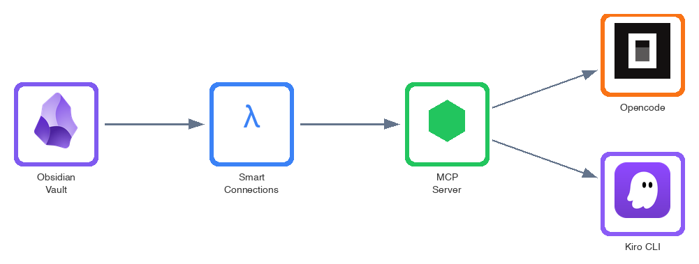

A few colleagues recently saw my Obsidian setup and asked how I get AI agents to search my notes semantically - not just keyword matching, but actually understanding what I'm looking for. The answer is a combination of three tools: **Smart Connections** for local embeddings, **MCP** (Model Context Protocol) for exposing those embeddings to AI agents, and optionally the new **Obsidian CLI** for write operations.

This post walks through the complete setup and shares some practical workflows I've found useful.

## Why This Setup?

Before diving into the how, let's address the why:

1. **Local embeddings**: All embeddings are computed and stored locally using Smart Connections' bundled model. Your notes aren't sent anywhere for embedding generation. (Note: when AI agents query results via MCP, the retrieved content is sent to your configured LLM provider - AWS Bedrock, Anthropic, etc. - unless you use a fully local setup like Ollama.)
2. **Semantic search**: Find notes by meaning, not just keywords. "Find notes about conference talk ideas" works even if none of your notes contain those exact words.
3. **AI-native**: AI agents (Opencode, Kiro CLI) can query your knowledge base directly through MCP tools.
4. **Zero embedding costs**: Smart Connections bundles a local embedding model - no OpenAI API calls needed for generating embeddings.

## The Architecture

Here's how the pieces fit together:



## Prerequisites

Before starting, you'll need:

- [Obsidian](https://obsidian.md/) installed with a vault containing some notes
- [Node.js](https://nodejs.org/) v18 or later
- An MCP-compatible client (Opencode, Kiro CLI, or similar)
- Basic comfort with the terminal

## Step 1: Install Smart Connections Plugin

Smart Connections is an Obsidian plugin that generates embeddings for your notes locally.

1. Open Obsidian Settings → Community plugins
2. Disable Safe mode if prompted
3. Click Browse and search for "Smart Connections"
4. Install and enable the plugin

### Initial Embedding Generation

After enabling the plugin, it will start generating embeddings for your notes in the background. You can monitor progress in the Smart Connections panel (click the brain icon in the sidebar).

**Important notes:**
- First-time embedding generation takes a few minutes depending on vault size
- Notes shorter than ~200 characters won't be embedded
- Embeddings are stored in `.smart-env/` folder in your vault
- The plugin uses TaylorAI/bge-micro-v2 model (384 dimensions) by default

You can verify embeddings are working by using the Smart Connections panel - it should show semantically similar notes when you open any note.

## Step 2: Set Up the MCP Server

The [smart-connections-mcp](https://github.com/msdanyg/smart-connections-mcp) server exposes your Smart Connections embeddings via MCP protocol.

```bash
# Clone the repository
git clone https://github.com/msdanyg/smart-connections-mcp.git

# I recommend placing it in a standard location
mkdir -p ~/.local/share/mcp-servers
mv smart-connections-mcp ~/.local/share/mcp-servers/

# Install dependencies and build
cd ~/.local/share/mcp-servers/smart-connections-mcp
npm install
npm run build
```

The server provides six MCP tools:

| Tool | Description |
|------|-------------|
| `search_notes` | Semantic search using text queries |
| `get_similar_notes` | Find notes similar to a given note |
| `get_connection_graph` | Build multi-level relationship graphs |
| `get_embedding_neighbors` | Direct vector similarity queries |
| `get_note_content` | Retrieve note content with block extraction |
| `get_stats` | Knowledge base statistics |

## Step 3: Configure Your MCP Client

### For Opencode

Add the server to your `~/.config/opencode/opencode.json`:

```json
{
  "mcp": {
    "smart-connections": {
      "type": "local",
      "command": [
        "node",
        "/Users/YOUR_USERNAME/.local/share/mcp-servers/smart-connections-mcp/dist/index.js"
      ],
      "environment": {
        "SMART_VAULT_PATH": "/path/to/your/obsidian/vault"
      },
      "enabled": true,
      "timeout": 120000
    }
  }
}
```

### For Kiro CLI

Kiro uses the same MCP configuration format. Add to your Kiro config:

```json
{
  "mcpServers": {
    "smart-connections": {
      "command": "node",
      "args": ["/Users/YOUR_USERNAME/.local/share/mcp-servers/smart-connections-mcp/dist/index.js"],
      "env": {
        "SMART_VAULT_PATH": "/path/to/your/obsidian/vault"
      }
    }
  }
}
```

### For Other MCP Clients

Other MCP-compatible clients (Claude Desktop, Claude Code, etc.) follow similar patterns - you'll need to specify the command, arguments, and environment variables pointing to your vault. Check your client's documentation for the exact configuration format.

**Remember to replace:**
- `YOUR_USERNAME` with your actual username
- `/path/to/your/obsidian/vault` with the absolute path to your Obsidian vault

## Step 4: Verify the Setup

Restart your MCP client and test the connection. In Opencode, try:

> "Search my notes for anything related to conference talks"

If configured correctly, the AI will use the `search_notes` tool and return semantically relevant results from your vault.

You can also check the stats:

> "Show me statistics about my knowledge base"

This should return something like:
```
Total notes: 137
Total blocks: 892
Embedding dimension: 384
Model: TaylorAI/bge-micro-v2
```

## Practical Workflows

Here are some workflows I've found genuinely useful:

### Aggregating Ideas for Conference Talks

This is the workflow that impressed my colleagues. I had a large backlog of scattered notes - ideas, observations, half-formed thoughts about various topics. Getting AI to aggregate them semantically was a game-changer:

> "Search my notes for ideas related to async Python programming. Then find notes similar to the top results to expand the search. Summarize the key themes."

The AI chains `search_notes` with `get_similar_notes` to build a comprehensive picture, then synthesizes it into actionable themes.

### Refactoring Notes for Different Audiences

When submitting to different conferences, I need to adjust the messaging. Same core ideas, different framing:

> "Find my notes about serverless architectures. Summarize them in a way that would fit a call for papers focused on cost optimization."

> "Now reframe the same content for a developer experience angle."

### Building Connection Graphs

Understanding how your notes relate to each other:

> "Build a connection graph starting from my note 'AI-assisted development.md' with depth 3. What clusters of related topics emerge?"

The `get_connection_graph` tool returns hierarchical relationships that reveal hidden connections between ideas.

### Quick Knowledge Base Queries

Day-to-day lookups when you can't remember where you wrote something:

> "Find notes where I discussed trade-offs between DynamoDB and PostgreSQL"

> "What did I write about error handling patterns?"

## The New Obsidian CLI (v1.12.0)

Obsidian recently released a CLI (February 2026) that complements this setup nicely. While the MCP server provides **read-only semantic access**, the CLI enables **write operations**:

```bash
# Create a new note
obsidian create "Meeting Notes/2025-02-12.md"

# Append content to a note
obsidian append "Ideas/conference-talks.md" "New idea: ..."

# Read daily note
obsidian daily:read

# Manage properties
obsidian property:set "note.md" status "published"
```

### Combined Workflow: AI Search → CLI Write

The real power comes from combining MCP (read) with CLI (write):

1. AI searches your vault via MCP: "Find all notes tagged #draft about Python"
2. AI analyzes and suggests consolidation
3. You approve, AI executes via CLI to create new consolidated note

This isn't fully automated yet (the AI can't directly invoke CLI commands), but the pattern is emerging. Some users are already scripting this with shell commands.

## Performance Notes

From my experience with a ~150 note vault:

- **Initial load**: 2-5 seconds for the MCP server to read embeddings
- **Search queries**: <50ms typically
- **Memory usage**: ~20-30MB for the server
- **Embedding generation**: Happens automatically when you edit notes in Obsidian

The embeddings themselves are small - the `.smart-env` folder is usually under 10MB even for large vaults.

## Troubleshooting

### "Server not found" or connection errors

1. Verify the path in your config is absolute and correct
2. Check that `npm run build` completed successfully
3. Ensure `SMART_VAULT_PATH` points to a vault with Smart Connections enabled
4. Restart your MCP client after config changes

### Empty search results

- Make sure Smart Connections has finished generating embeddings (check the plugin panel)
- Notes shorter than ~200 characters aren't embedded
- Try broader search terms

### Slow initial queries

The first query after starting the server loads embeddings into memory. Subsequent queries are much faster.

### "Embedding dimension mismatch"

If you changed Smart Connections' embedding model, regenerate embeddings:
1. Delete the `.smart-env` folder in your vault
2. Restart Obsidian
3. Wait for Smart Connections to regenerate embeddings

## Security Considerations

A few things to keep in mind:

- **The MCP server has read access to your entire vault.** Only enable it for vaults you're comfortable exposing to AI agents.
- **Embeddings can leak information.** While not human-readable, embeddings encode semantic content. Treat `.smart-env` with appropriate care.
- **MCP requires explicit consent.** Well-designed MCP clients ask before invoking tools. Don't disable these safeguards.

## Alternatives and Trade-offs

This isn't the only approach. Here are some alternatives:

| Approach | Pros | Cons |
|----------|------|------|
| **Smart Connections + MCP** (this guide) | Privacy-first, free, semantic search | Requires setup, local only |
| **Obsidian Copilot plugin** | Simpler setup, integrated UI | Less flexible for agentic workflows |
| **RAG with cloud embeddings** | Higher quality embeddings, more models | API costs, privacy concerns |
| **Direct file access** | No setup needed | No semantic search, just keyword matching |

For my use case - privacy-sensitive notes that I want AI to search semantically - the Smart Connections + MCP approach hits the sweet spot.

## What's Next?

The MCP ecosystem is growing rapidly. Some things I'm watching:

- **Better CLI integration**: As Obsidian CLI matures, tighter AI → CLI workflows become possible
- **Multi-vault support**: Currently one vault per MCP server instance
- **Embedding model options**: Smart Connections Pro offers more model choices
- **Two-way sync**: AI agents that can both read and write through MCP

## Resources

- [Smart Connections Plugin](https://github.com/brianpetro/obsidian-smart-connections) - Official GitHub repository
- [smart-connections-mcp](https://github.com/msdanyg/smart-connections-mcp) - MCP server for Smart Connections
- [Model Context Protocol](https://modelcontextprotocol.io/) - Official MCP specification
- [Obsidian CLI Documentation](https://obsidian.md/changelog/2026-02-10-desktop-v1.12.0/) - Release notes with CLI details
- [Opencode](https://opencode.ai/) - Open source AI coding agent with MCP support
- [Kiro CLI](https://kiro.dev/) - AWS's AI development tool

---

*This setup has genuinely changed how I work with my notes. If you try it out, I'd love to hear what workflows you discover - always open for discussion on better approaches!*
