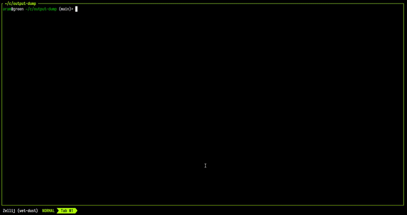

My terminal history before Zellij: years on [Tabby](https://tabby.sh/), which I genuinely liked - it synced and restored sessions across machines, looked great, had a slick UI. The problem was performance. Electron-backed terminal emulators have a ceiling, and I kept hitting it. I experimented with tmux as an escape, but the learning curve and the complete absence of onboarding UX threw me off. No visual hints, no discoverable keybindings, a config that requires you to already know what you want before you can write it. I bounced off it twice.

[Zellij](https://zellij.dev/) is what finally stuck. It's a terminal multiplexer - splits, tabs, panes, the usual - but with a keybinding bar at the bottom that shows available actions in whatever mode you're in. You don't need to memorize the keymap on day one. It's the kind of UX detail that feels minor until you've spent an evening staring at a tmux cheatsheet trying to remember how to split a pane vertically.

The thing that actually hooked me though was `session_serialization`. Zellij serializes the entire session - all tabs, all panes, their working directories, and the command running in each pane - to disk every second. When the machine reboots or I close Ghostty by accident, I `zellij attach` and the layout is back exactly as I left it. No rebuilding, no re-`cd`ing.

## What "restored" actually means

There's an important nuance to session resurrection worth spelling out. Zellij brings back the layout and re-runs commands in command panes - behind a "Press Enter to run..." prompt, so you don't accidentally re-execute something destructive.

What it does *not* restore is the shell session underneath. If you were running opencode or a local dev server, the pane revives the command - but if that process had already exited before the crash, the pane comes back blank, and the shell history that built up in it is gone.

That's a known limitation, not a bug: per-pane shell history isn't Zellij's job, it's your shell's. Tools like [Atuin](/til/atuin/) handle it far better than the shell does natively, and the combination of the two covers most of what I used to miss about Tabby's session sync.

My workflow: one persistent Zellij session, tabs named after whatever I'm working on. I try to keep it to three to five tabs maximum. In the AI-assisted development era, if something can't be wrapped up fast enough that it needs a dedicated tab for days, it probably needs to wait or get a proper spec written for it - not a zombie tab holding a pile of context I keep meaning to get back to. Learning tasks are the exception: sometimes the bottleneck is genuinely my brain and not the tooling, and those tabs deserve to stay open.

The config took some work because of conflicts with Ghostty and Karabiner-Elements - I've written that up separately in a [dedicated TIL](/til/ghostty-karabiner-zellij/). The scrollback is set to 50,000 lines with `copy_on_select true`, which makes terminal output usable as a scratchpad. `pane_frames false` reclaims visual space once you've internalized the layout.

I still low-key miss how frictionless Tabby's cloud sync was. But the performance tradeoff isn't worth it, and Zellij plus named sessions gets me most of the way there.

- [zellij.dev](https://zellij.dev/)
- [Zellij docs: session resurrection](https://zellij.dev/documentation/session-resurrection)
- [My shell setup bootstrap script](https://gist.github.com/3sztof/0d3f5c30510fcb8be23273bbbe1413ba)
